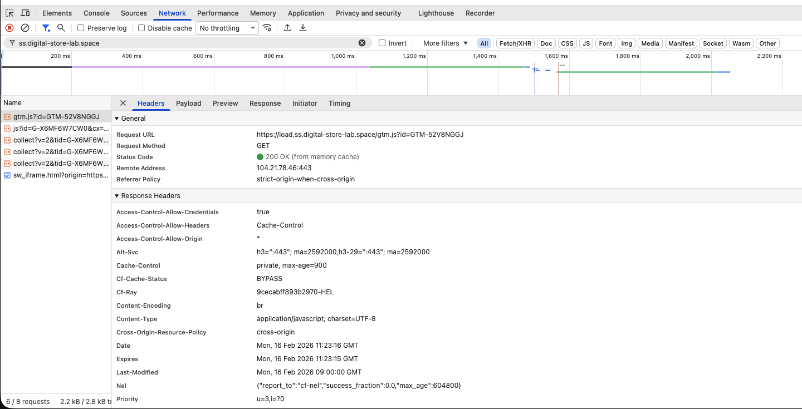
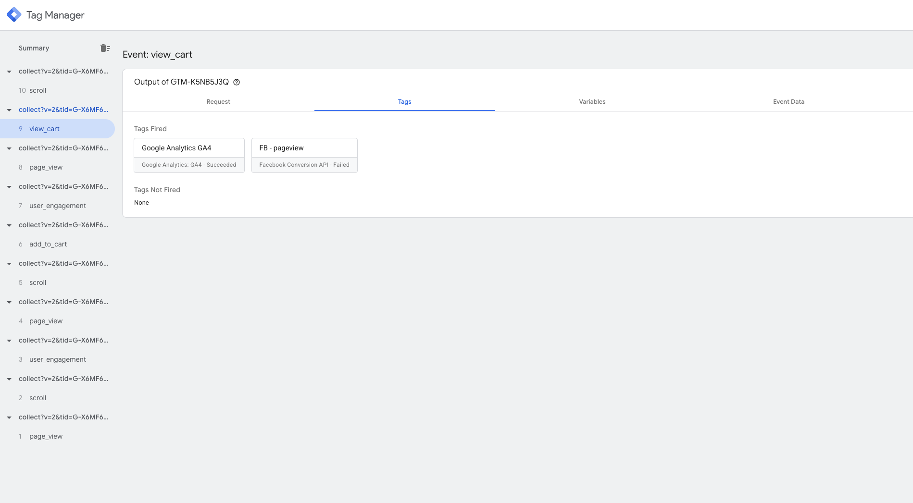
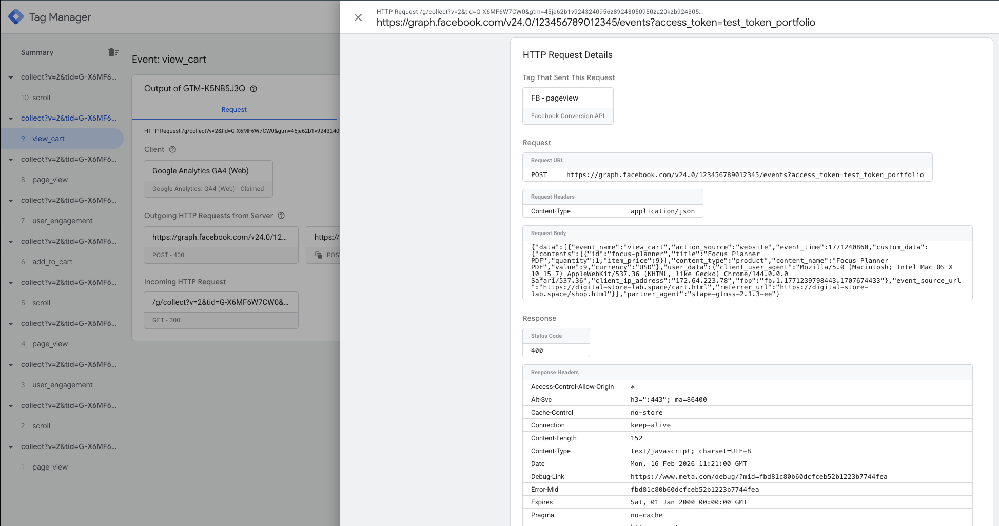
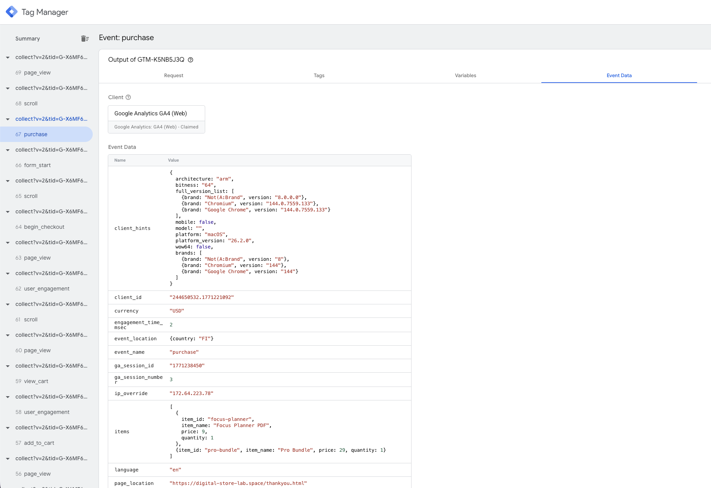

# 📊 Digital Store Lab — Ecommerce Analytics Project

> A hands-on learning project built to practice real-world analytics implementation:
> **GTM → DataLayer → GA4 → Consent Mode → Server-side tracking**

🌐 Live site: [digital-store-lab.space](https://digital-store-lab.space)
📁 Repository: [github.com/EKukarskiy/digital-store-lab](https://github.com/EKukarskiy/digital-store-lab)

---

## 🗂 Project Structure

| Page | Purpose |
|---|---|
| `/index.html` | Homepage |
| `/shop.html` | Product catalog |
| `/product.html` | Product detail page |
| `/cart.html` | Shopping cart |
| `/checkout.html` | Checkout |
| `/thankyou.html` | Purchase confirmation |

---

## ⚙️ Technical Stack

- **Hosting:** GitHub Pages (static, publicly accessible)
- **Domain & Proxy:** Custom domain via Cloudflare (DNS, WAF, Workers)
- **Server-side Infrastructure:** Stape.io (managed sGTM hosting)
- **Tag Management:** Google Tag Manager — Web + Server container
- **Analytics:** Google Analytics 4 (GA4)
- **Consent:** Advanced Consent Mode (CoMo v2)

---

## 🛡️ Server-Side Tracking — 1st Party Infrastructure

This project goes beyond standard GTM implementation. I designed and deployed a full **1st-party server-side tracking infrastructure** — a setup typically reserved for production ecommerce environments.

### What was implemented

A complete data pipeline where the browser never communicates directly with Google or any third-party analytics domain. All traffic is routed through infrastructure I control.

```
Browser → digital-store-lab.space (Cloudflare Worker)
       → ss.digital-store-lab.space (Stape)
       → Server GTM
       → GA4 / Facebook Conversion API
```

### Why it matters

**Adblocker resistance** — GTM loads from the site's own domain. Standard blocklist rules targeting `googletagmanager.com` have no effect.

**Safari ITP compliance** — Cookies are set as true 1st-party through JavaScript Managed mode in sGTM, guaranteeing up to 2 years lifetime instead of 7 days.

**Data ownership** — All events pass through Server GTM before reaching any vendor. This enables data cleaning, PII removal (IP stripping for GDPR), and selective forwarding to GA4, Facebook, and other platforms.

### Infrastructure stack

| Layer | Technology | Role |
|---|---|---|
| DNS & Proxy | Cloudflare | Routes traffic, applies Worker, SSL |
| Worker | Cloudflare Worker (`/mt/*`) | Intercepts & transforms requests |
| Server hosting | Stape.io | Managed sGTM infrastructure |
| Data endpoint | `ss.digital-store-lab.space` | 1st-party collection domain |
| Script delivery | `load.ss.digital-store-lab.space` | 1st-party GTM script loading |



### Notable implementation detail

The project runs on a **static HTML site** (no CMS). Unlike WordPress or Shopify where GTM code lives in one template, each of the seven pages required manual GTM snippet updates to point to the 1st-party endpoints — a practical reminder of how infrastructure decisions affect implementation work at every level.





---

## 📡 DataLayer Events

All events are pushed from the frontend via `dataLayer.push()`.
GTM does not parse the DOM — ecommerce data is passed strictly through the `ecommerce` object.

**Rule:** one event = one GA4 tag.

| Event | Status |
|---|---|
| `view_item` | ✅ |
| `add_to_cart` | ✅ |
| `view_cart` | ✅ |
| `begin_checkout` | ✅ |
| `purchase` | ✅ |
| `scroll_events` | ✅ |
| `form_submits` | ✅ |



---

## 🔒 Web Analytics & Consent Governance

In this project, I implemented a **Consent Management Framework** to ensure compliance with GDPR and DMA (Digital Markets Act) while maintaining data integrity in GA4.

### Key Implementation Details

**Advanced Consent Mode (CoMo v2)**
GTM is configured to respect user privacy signals. By default, all tracking tags are in a denied state until explicit user interaction — ensuring no unauthorized data collection occurs.

**GTM Tag Governance**
Used the Consent Overview feature in GTM to audit and control tag behavior. Tags are mapped to specific consent types (`ad_storage`, `analytics_storage`), allowing for cookieless pings even when cookies are rejected.

**State Management & DataLayer**
Designed a custom `dataLayer` architecture that synchronizes the Consent Banner UI with the GTM environment in real-time — without requiring a page reload.

**Privacy-First Attribution**
Configured the setup to maintain high-quality attribution data while honoring the user's right to opt-out — a critical skill for modern digital measurement.

### How to Audit the Setup

1. **GTM Preview Mode** — Open the Summary pane. The initial `Consent` event must show **denied** for all categories as the very first action.
2. **Consent Update** — Upon clicking "Accept," a `Consent Update` event is triggered, switching tag behavior from restricted to active.
3. **GCS Parameter** — Verify the `gcs` parameter in outgoing GA4 hits (e.g., `G100` for denied, `G111` for granted) via the Network tab or GTM Debugger.

---

## 📘 Facebook Conversions API — Architecture Demo

As part of this project, I configured a **Facebook Conversions API (CAPI)** integration via Server GTM using the Stape Facebook CAPI tag.

> **Note:** No live Meta Business account was used. The integration was built and validated at the infrastructure level to demonstrate architecture and configuration skills — the standard workflow in agency and in-house analytics roles, where the analyst configures the pipeline using credentials provided by the client.

### What was configured

- Stape Facebook CAPI tag added to sGTM from the Template Gallery
- Tag set to **Inherit from client** — automatically maps GA4 events to standard Facebook events
- Trigger: `CE - All Events` — fires on all incoming events from the web container
- Full ecommerce payload verified in sGTM Preview Mode

### Verified request payload (sGTM Preview)

The tag fires and sends a correctly structured `POST` request to `graph.facebook.com`. The payload below confirms that all ecommerce parameters are correctly mapped:

```json
{
  "data": [{
    "event_name": "AddToCart",
    "action_source": "website",
    "event_time": 1771240297,
    "custom_data": {
      "contents": [{"id": "focus-planner", "title": "Focus Planner PDF", "quantity": 1, "item_price": 9}],
      "content_type": "product",
      "content_name": "Focus Planner PDF",
      "value": 9,
      "currency": "USD"
    },
    "user_data": {
      "client_user_agent": "Mozilla/5.0...",
      "client_ip_address": "172.64.x.x",
      "fbp": "fb.1.xxx.xxx"
    },
    "event_source_url": "https://digital-store-lab.space/shop.html"
  }],
  "partner_agent": "stape-gtmss-2.1.3-ee"
}
```

**Response:** `400 Invalid OAuth access token` — expected, as test credentials were used. With a real `Pixel ID` and `Access Token` from Meta Business Manager, the response would be `200` and events would appear in Meta Events Manager.

### GA4 → Facebook event mapping (automatic)

| GA4 Event | Facebook Event |
|---|---|
| `page_view` | `PageView` |
| `view_item` | `ViewContent` |
| `add_to_cart` | `AddToCart` |
| `begin_checkout` | `InitiateCheckout` |
| `purchase` | `Purchase` |

---

## 🎯 Why This Project

This project was built as a **portfolio piece** combining learning with real, employer-ready skills:

- ✅ GTM + ecommerce tracking (DataLayer architecture)
- ✅ GA4 (correct Measurement Protocol)
- ✅ Server-side GTM on production-grade infrastructure
- ✅ 1st-party data collection (Cloudflare + Stape)
- ✅ Facebook Conversions API via sGTM (architecture + payload verified)
- ✅ Consent Mode & privacy-first analytics

> Skills directly requested in job listings for analytics roles.

---

## 📬 Contact

Built by **Evgeny Kukarskiy**
[github.com/EKukarskiy](https://github.com/EKukarskiy)
